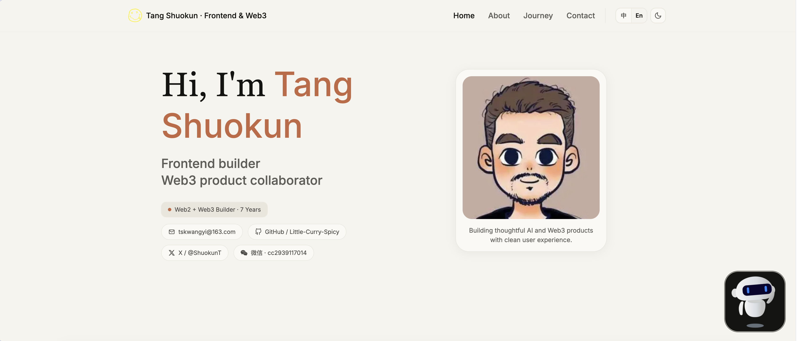

# Tang Shuokun · 个人作品集站点

基于 **React**、**Three.js** 与 **Vite** 的响应式个人网站，含 3D 场景、中英切换与明暗主题。

[](https://1996tsk.top/)



---

## 在线预览

**正式环境：** [https://1996tsk.top/](https://1996tsk.top/)

本地开发启动后，在浏览器打开终端里提示的地址（Vite 默认为 [http://localhost:5173](http://localhost:5173)）。

---

## 功能概览

| 能力       | 说明                                                              |
| :--------- | :---------------------------------------------------------------- |
| 多页面路由 | `react-router-dom`，含 404 页                                     |
| 国际化     | 中英文文案（`src/i18n`）                                          |
| 主题       | 明暗模式（`src/context/ThemeContext.tsx`）                        |
| 3D 与动效  | `@react-three/fiber`、`@react-three/drei`、`three`、Framer Motion |
| About 技术徽章 | 关于我文案支持 `{{typescript}}` 这类占位符，自动渲染为带图标技术标签 |
| 视觉基调  | 工作室感 boutique：暖奶油底、Fraunces 标题 + DM Sans 正文、柔和天蓝主按钮、顶部胶囊导航；首屏带轻线描云与黏土色柔光装饰（不替换真人头像与联系区地球） |
| 联系表单   | [Web3Forms](https://web3forms.com/)，需配置访问密钥               |
| SEO / 分享 | 构建时通过 `vite.config.js` 将环境变量写入 `index.html` 占位符    |

---

## 技术栈

- [TypeScript](https://www.typescriptlang.org/)
- [Vite](https://vitejs.dev/)
- [React 19](https://react.dev/)
- [React Router](https://reactrouter.com/)
- [Three.js](https://threejs.org/) · [@react-three/fiber](https://docs.pmnd.rs/react-three-fiber/getting-started/introduction) · [@react-three/drei](https://github.com/pmndrs/drei)
- [Framer Motion](https://www.framer.com/motion/)
- [Tailwind CSS](https://tailwindcss.com/)

[](https://skillicons.dev)

---

## 仓库结构（摘要）

```text
reactjs18-3d-portfolio/
├── src/
│   ├── App.tsx                 # 路由与根布局
│   ├── main.tsx                # 入口（Provider、主题、i18n）
│   ├── pages/                  # 页面（如 Home、404）
│   ├── components/
│   │   ├── atoms/              # 小组件
│   │   ├── canvas/             # 3D Canvas 相关
│   │   ├── layout/             # 导航、加载等
│   │   └── sections/           # 首页各区块 + SectionWrapper
│   ├── context/                # 主题、语言等 Context
│   ├── i18n/                   # 文案与目录
│   ├── shared/                 # 通用 UI / 动效
│   ├── constants/              # config、样式常量
│   ├── utils/                  # 工具（如 motion 配置）
│   ├── types/
│   └── assets/
├── public/                     # 静态资源、GLTF、logo 等
├── index.html
├── postcss.config.mjs            # Tailwind v4：@tailwindcss/postcss（官方 PostCSS 集成）
├── vite.config.js              # 别名 @/、HTML SEO 占位符
├── tsconfig.json
├── package.json
├── 1.png                       # README 用站点截图（可选）
└── README.md
```

**架构说明（简要）**

- 路由与根组件：`src/App.tsx`；入口：`src/main.tsx`。
- 页面：`src/pages`；首页区块：`src/components/sections`。
- 路径别名 `@/` 指向 `src/`，见 `tsconfig.json` 与 `vite.config.js`。

---

## 本地运行

### 环境要求

- [Node.js](https://nodejs.org/)（建议使用当前 LTS）
- [pnpm](https://pnpm.io/installation)

### 安装与启动

1. 克隆或下载本仓库后，在项目根目录执行：

   ```bash
   pnpm install
   ```

2. 复制并填写环境变量（见下一节），至少保证 `VITE_SITE_URL` 等与 `index.html` 占位符一致，避免构建时报错。

3. 启动开发服务：

   ```bash
   pnpm dev
   ```

4. 在浏览器中打开终端输出的本地地址（一般为 `http://localhost:5173`）。

### npm 脚本

| 命令            | 作用                                     |
| :-------------- | :--------------------------------------- |
| `pnpm dev`      | 启动 Vite 开发服务器                     |
| `pnpm build`    | 类型检查 + 生产构建，输出到 `dist/`      |
| `pnpm preview`  | 本地预览构建产物                         |
| `pnpm ts:check` | 仅运行 TypeScript 检查（`tsc --noEmit`） |

---

## 环境变量

在项目根目录创建 `.env`（可参考仓库内示例或下列字段）。**构建前**应配置好，以便 `vite.config.js` 中的 `loadEnv` 能读取并替换 `index.html` 中的占位符。

```env
# 站点绝对地址（无尾部斜杠），用于 OG 等
VITE_SITE_URL=https://1996tsk.top

# Cloudflare Web Analytics token（可选）
VITE_CF_WEB_ANALYTICS_TOKEN=<your-cloudflare-analytics-token>

# 联系表单：https://web3forms.com/ 申请后填入；未配置时表单会提示需配置
VITE_WEB3FORMS_ACCESS_KEY=<your-web3forms-access-key>

# 页面标题与社交分享文案（构建时写入 index.html）
VITE_HTML_TITLE=Tang Shuokun · Frontend & Web3
VITE_OG_TITLE=Tang Shuokun · Frontend & Web3
VITE_OG_DESCRIPTION=用于链接预览的简短站点描述
```

站点内展示姓名、邮箱、社交链接等，主要在 `src/constants/config.ts` 与 `src/i18n` 中维护。

---

## 部署说明

本项目为 **Vite 静态站点**，无 Next.js 运行时。部署流程：

1. 执行 `pnpm build` 生成 `dist/`。
2. 将 `dist/` 上传到任意静态托管（如 Nginx、对象存储 + CDN、[Vercel](https://vercel.com/)、[Netlify](https://www.netlify.com/) 等）。
3. 生产环境的 `VITE_SITE_URL` 应与实际上线域名一致（例如 `https://1996tsk.top`），以便分享卡片与 SEO 正确。

若使用 Vercel / Netlify，将 **Build command** 设为 `pnpm build`，**Output directory** 设为 `dist`。

---

## 致谢与参考

- 项目形态与部分实现思路参考社区中的 **React + Three.js 作品集** 教程与模板生态。
- [Three.js](https://threejs.org/) · [React Three Fiber](https://docs.pmnd.rs/react-three-fiber/getting-started/introduction) · [drei](https://github.com/pmndrs/drei)
- [Framer Motion](https://www.framer.com/motion/)
- [Tailwind CSS](https://tailwindcss.com/)
- [React Vertical Timeline Component](https://www.npmjs.com/package/react-vertical-timeline-component)
- [Web3Forms](https://web3forms.com/)
- [JavaScript Mastery](https://www.jsmastery.pro/)

---

## 联系

- **GitHub：** [Little-Curry-Spicy](https://github.com/Little-Curry-Spicy)
- **X：** [@ShuokunT](https://x.com/ShuokunT)
- **邮箱：** [tskwangyi@163.com](mailto:tskwangyi@163.com)

如需二次开发或合作，欢迎通过上述方式联系。
